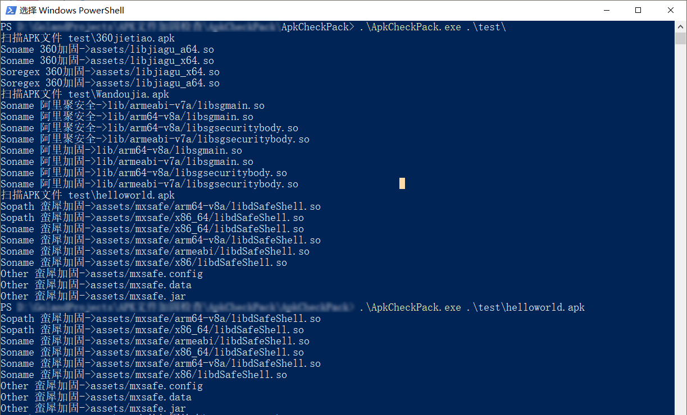
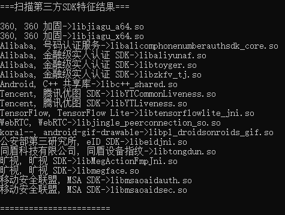

# ApkCheckPack

**欢迎大家提交规则，或留意无法识别的加固app（提供demo或vt类下载哈希），争取每季度更新**

**说明**

工具只是辅助，新方式和厂商不断出现，特征查找方式可能遗漏，切勿完全依赖

由于变动较大，工具更名为ApkCheckPack，大概是加固规则最全的开源工具：）

将能收集到的加固特征汇总整理，支持40个厂商的加固检测，保存在apkpackdata.json文件，格式如下，有需求自取

    sopath 绝对路径的特征so
    
    soname 仅特征so文件名
    
    other 其他特征文件、字符串
    
    soregex 对有版本号的特征so库，使用正则匹配

改用go语言实现，规则也集成到单exe使用更方便

到releases下载编译好的文件，后面跟文件或文件夹执行（已放弃GUI版本）

支持的功能

    √ 特征so库扫描：通过对比加固特征so库名/路径，判断是否有加固
    X （临时取消）校验签名：校验V2签名，判断是否存在Janus漏洞
    √ 密钥泄露：扫描Apk文件内容，匹配是否有密钥字符串
    √ 反环境检测：扫描Dex文件搜索是否有Root、模拟器、反调试检测
    √ 开发框架扫描：扫描特征so库名，判断是否有第三方SDK

使用参数-s=true（默认false）开启全文件硬编码信息扫描

    ApkCheckPack.exe -s=false -f test.apk

加固规则更新时间 20231227，第三方SDK规则更新时间 20240922