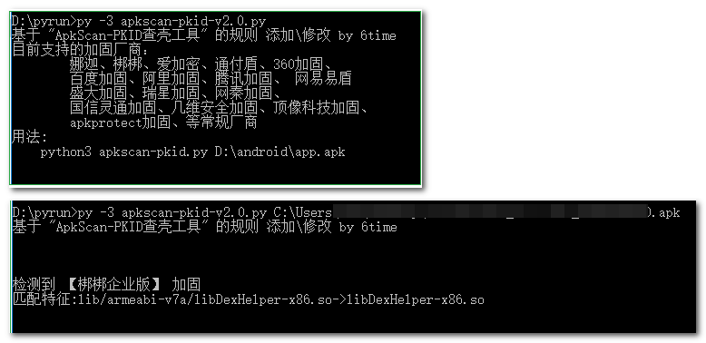

# apkscan-pkid-v2.0

**欢迎大家提交规则，或留意无法识别的加固app，争取每季度更新**

更新记录：

​	  20220325 新添 腾讯乐固（VMP） apk加固检测

​	  20220427 修改逻辑 优化输出，修复二级子目录检测不到的bug

​	  20220721 新添 蛮犀加固 检测，添加临时gui版本，后续考虑优化

20220721 添加临时GUI版本，将apk文件拖到界面，自动输出结果，GUI版本需要安装依赖库windnd，所以在Releases打包了一个exe（win10 x64）方便大家使用，不放心可以下载源码使用

cmd执行效果，help和检测apk

