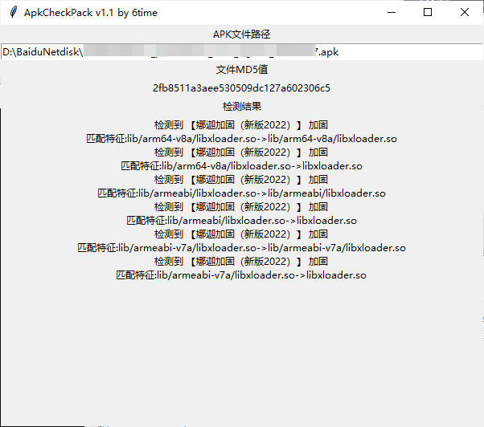
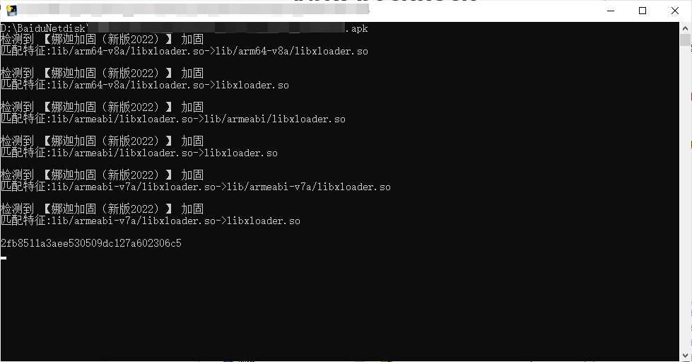

# ApkCheckPack

**欢迎大家提交规则，或留意无法识别的加固app，争取每季度更新**

**说明**

工具只是辅助，新方式和厂商不断出现，特征查找方式可能遗漏，切勿完全依赖

由于变动较大，工具更名为ApkCheckPack，大概是加固规则最全的开源工具：）

将收集到的加固特征汇总整理，最后得到约170条，保存在apkpack.json文件，有需求自取

py文件方式运行需安装依赖库，改为读取json文件获取加固规则（v1.2）有新规则修改同目录apkpack.json就行

```
pip3 install windnd
```

源码仅保留GUI版本，将apk文件拖到界面，自动输出结果，为了方便复制信息，保留了cmd黑框框

GUI版本需要安装依赖库windnd，在Releases打包了一个exe（win10 x64）方便大家使用，但exe文件不会实时更新，不放心可以下载源码使用






**注意：因为某讯和某加固两个都存在libexec.so，因此这两个厂商的结果会出现一条混杂的，需要人工分辨，一般特征条数多的正确**

