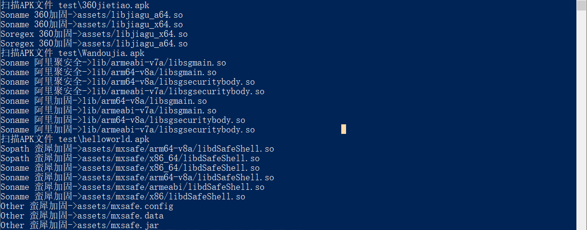

# ApkCheckPack

**欢迎大家提交规则，或留意无法识别的加固app（提供demo或vt类下载哈希），争取每季度更新**

**说明**

工具只是辅助，新方式和厂商不断出现，特征查找方式可能遗漏，切勿完全依赖

由于变动较大，工具更名为ApkCheckPack，大概是加固规则最全的开源工具：）

将能收集到的加固特征汇总整理，支持40个厂商的加固检测，保存在apkpack.json文件，有需求自取

规则更新时间 20231227

    sopath 绝对路径的特征so

    soname 仅特征so文件名

    other 其他特征文件、字符串

    soregex 对有版本号的特征so库，使用正则匹配

改用go语言实现，规则也集成到单exe使用更方便

exe后面跟文件或文件夹就行，所以放弃GUI版本了

