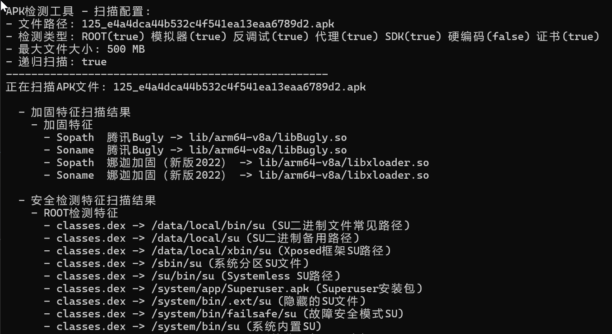

# ApkCheckPack

**APK 加固检测工具** — 检测 Android APK 的加固特征、第三方 SDK、安全检测和硬编码信息

## 功能特性

- **加固检测** — 基于特征库检测 40+ 厂商的加固方案（so库名/路径、类名、正则匹配）
- **安全检测** — 检测 ROOT、模拟器、反调试、代理检测等反环境特征
- **第三方 SDK** — 识别常见广告、推送、统计等 SDK
- **硬编码扫描** — 扫描敏感信息泄露（可选，需开启 `-hardcode`）
- **证书扫描** — 检测 APK 中的证书文件并输出详情
- **内嵌 APK** — 支持递归扫描 XAPK 等内嵌 APK 文件

## 编译

```bash
go build -o ApkCheckPack.exe ./cmd/apkcheckpack
```

## 使用方法

```bash
ApkCheckPack.exe -f <APK文件路径或文件夹>
```

### 参数说明

| 参数 | 默认 | 说明 |
|------|------|------|
| `-f` | 必填 | APK 文件路径或文件夹路径 |
| `-root` | true | 检测 ROOT 特征 |
| `-emu` | true | 检测模拟器特征 |
| `-debug` | true | 检测反调试特征 |
| `-proxy` | true | 检测代理特征 |
| `-sdk` | true | 检测第三方 SDK |
| `-hardcode` | false | 启用硬编码扫描（可选） |
| `-cert` | true | 检测证书信息 |
| `-maxsize` | 500 | 单文件最大扫描大小 (MB) |
| `-r` | true | 递归扫描内嵌 APK |

### 示例

```bash
# 扫描单个 APK
ApkCheckPack.exe -f test.apk

# 扫描文件夹
ApkCheckPack.exe -f ./apks

# 开启硬编码扫描
ApkCheckPack.exe -f test.apk -hardcode true

# 限制扫描文件大小
ApkCheckPack.exe -f test.apk -maxsize 100
```



## 项目结构

```
ApkCheckPack/
├── cmd/apkcheckpack/main.go     # 主入口
├── pkg/
│   ├── sdk/                     # 第三方 SDK 检测
│   ├── pack/                    # 加固检测
│   ├── anti/                    # ROOT/模拟器/反调试/代理检测
│   ├── hardcode/                # 硬编码检测
│   └── certificate/             # 证书检测
└── go.mod
```

**规则内置** — 所有规则数据编译到可执行文件中，无需外部配置。加固规则更新时间 20260111，第三方SDK规则更新时间 20260111。

```
sopath      绝对路径的特征so
soname      仅特征so文件名
other       其他特征文件、字符串
soregex     对有版本号的特征so库，使用正则匹配
jclass      dex内的java编译后代码，字符串匹配
```

## 说明

工具只是辅助，新方式和厂商不断出现，特征查找方式可能遗漏，切勿完全依赖。

欢迎提交规则，或提供无法识别的加固样本，争取持续更新。
