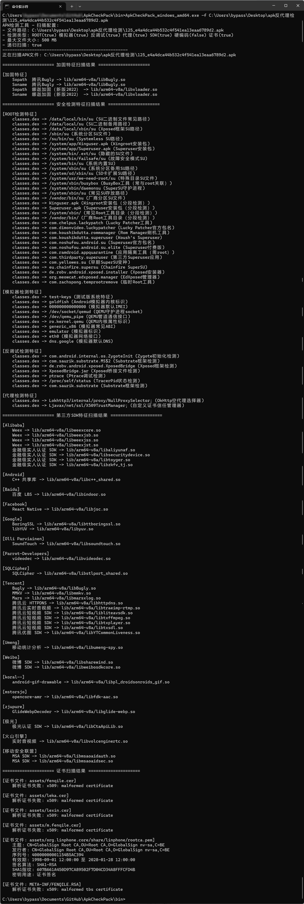

# ApkCheckPack

**Welcome everyone to submit rules, or pay attention to unrecognized reinforcement apps (provide demo or VT download hash), and strive to update quarterly**

**Explanation（The file is machine translated）**

English Please look: ./README_EN.md

Tools are only auxiliary, new methods and vendors are constantly emerging, and feature search methods may be overlooked. Do not rely solely on them

Due to significant changes, the tool has been renamed as ApkCheckPack, which is probably the most comprehensive open-source tool for hardening rules

Summarize and organize the reinforcement features that can be collected, support reinforcement testing from 40 vendors, and save them in the apkpackdata.json file in the following format. If needed, retrieve them yourself (reinforcement rule update time 20250624, third-party SDK rule update time 20240922)

    Sophath The Characteristics of Absolute Path
    Soname only features so file name
    Other feature files, strings
    Soregex uses regular matching for feature libraries with version numbers

Supported Features

    √ Reinforcement feature scanning: By comparing the reinforcement feature so library name/path, determine whether there is reinforcement
    √ Anti environment detection: Scan Dex files to search for Root, emulator, and anti debugging detection
    √ Development framework scanning: Scan the feature so library name to determine if there is a third-party SDK
    √ Anti proxy detection: Scan the proxy detection class name to determine if there is any anti proxy detection
    √ Embedded APK Scan: Some enhancements may embed multiple APK files within the APK
    √ Certificate file scanning: scan certificate files by suffix and output Information
    X (temporary cancellation) verification signature: Verify the V2 signature to determine if there is a Janus vulnerability
    √ Key leakage: Scan the content of the Apk file to match whether there is a key string

Implement in Go language instead, and integrate the rules into a single exe for easier use

Download the compiled file from releases and execute it following the file or folder (GUI version abandoned)

Use the parameter - hardcode to enable full file hard coded Information scanning, and pay attention to the default maximum scanning of 500MB internal files

    ApkCheckPack.exe -hardcode true -f test.apk

